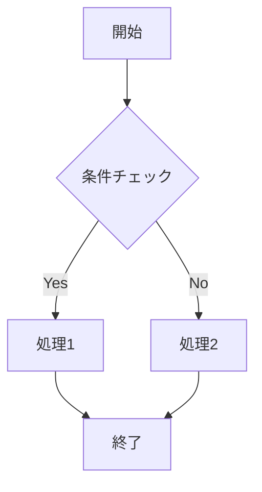
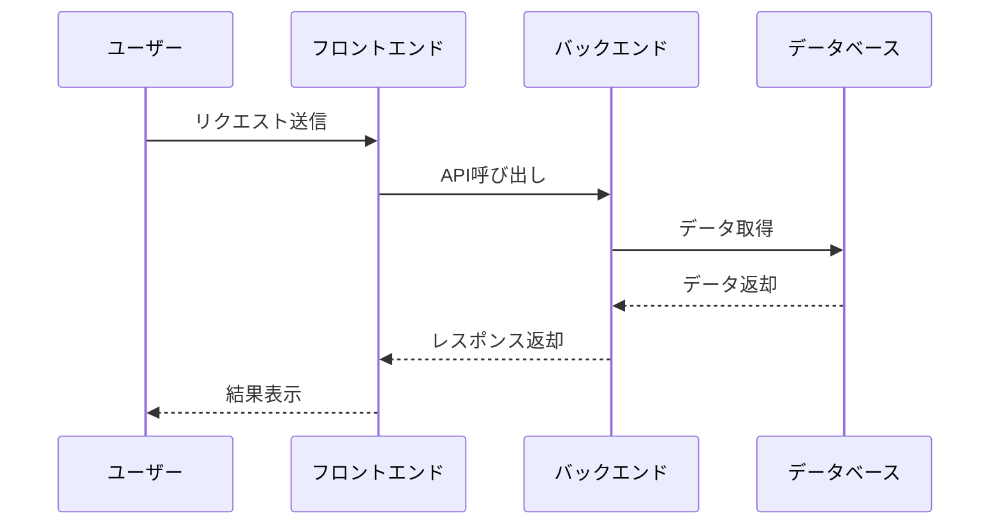
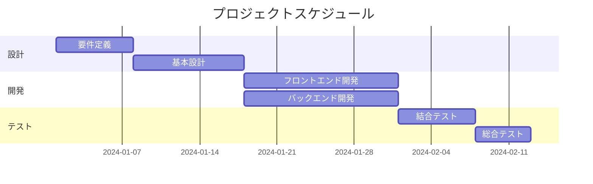
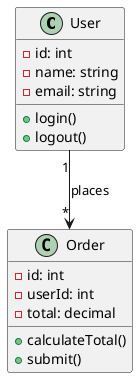
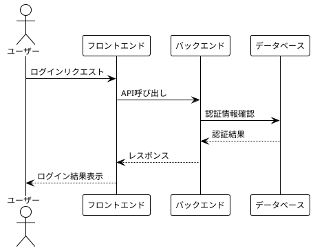
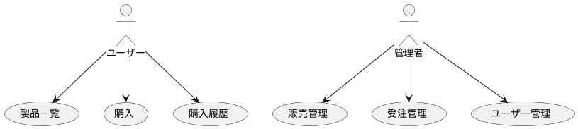

# テンプレート記事

これは記事のテンプレートです。

## 使い方

- このファイルをコピーして新しいファイル名に変更してください
- フロントマター（`---`で囲まれた部分）を編集してください
- 本文をMarkdown形式で記述してください

## フロントマターの説明

- `title`: 記事のタイトル
- `date`: 公開日時（ISO 8601形式）
- `template`: テンプレートタイプ（通常は"post"）
- `draft`: 下書きフラグ（`false`で公開、`true`で非公開）
- `category`: カテゴリ
- `description`: 記事の説明（SEO用）
- `tags`: タグのリスト
```markdown
---
title: テンプレート記事
date: "2026-01-01T12:00:00+0900"
template: "post"
draft: false
category: "blog"
description: "これは記事のテンプレートです。このファイルをコピーして新しい記事を作成してください。"
tags:
  - "テンプレート"
  - "サンプル"
---
```

## Markdown記法

通常のMarkdown記法が使用できます。

- **太字**
- *斜体*
- `コード`
- [リンク](https://example.com)

```typescript
// コードブロックも使用可能
const example = "Hello, World!";
```

## 画像
```

```


## Mermaid図

Mermaidを使用して図表を作成できます。

### フローチャート



### シーケンス図



### ガントチャート



## PlantUML図

PlantUMLを使用して図表を作成できます。

### クラス図



### シーケンス図



### ユースケース図


